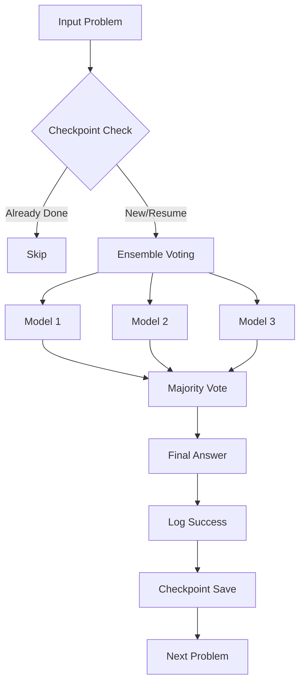
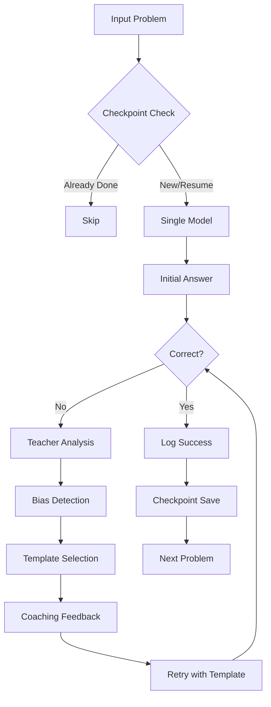

# Complete Systems Walkthrough: Ensemble vs Multi-turn Experimental Conditions

This document provides exact step-by-step demonstrations of how the **ensemble voting** and **multi-turn self-correction** systems function as **separate experimental conditions** to compare their effectiveness, along with the **checkpoint resumption** system that supports both.

## 🧪 Experimental Design Overview

The system is designed to run **comparative experiments** between two approaches:

1. **🗳️ Ensemble Voting**: Multiple models vote on answers (single-turn)
2. **🔄 Multi-turn Self-Correction**: Single model with iterative feedback (multi-turn)
3. **📊 Baseline**: Single model, single-turn for comparison

**Key Point**: These are **separate experimental conditions**, not combined systems!

---

## 🎯 System Architecture Overview

### Ensemble Experiment Flow


### Multi-turn Experiment Flow


---

## 🗳️ Part 1: Ensemble Voting Experiment (Single-turn)

### **Step 1: Set up Ensemble-Only Configuration**

**File: `configs/ensemble_experiments/demo_ensemble_only.json`**
```json
{
  "name": "Demo Ensemble Voting Only",
  "description": "Pure ensemble voting without multi-turn correction",
  "provider": "mixed",
  "ensemble_size": 3,
  "ensemble_configs": [
    {
      "provider": "demo",
      "model": "demo-openai-mini"
    },
    {
      "provider": "demo", 
      "model": "demo-anthropic-haiku"
    },
    {
      "provider": "demo",
      "model": "demo-openai-4o"
    }
  ],
  "voting_strategy": "adaptive",
  "features": {
    "enable_confidence": true,
    "enable_error_awareness": false,
    "enable_multi_turn": false
  },
  "experiment_settings": {
    "max_turns": 1,
    "temperature": 0.2,
    "max_tokens": 1024
  }
}
```

### **Step 2: Execute Ensemble-Only Experiment**

**Command:**
```bash
cd /Users/bradleyharaguchi/Algoverse-Self-Correction-Classification

python run_ensemble_experiments.py \
  --config configs/ensemble_experiments/demo_ensemble_only.json \
  --dataset data/math20.csv \
  --subset subset_5 \
  --demo \
  --output-dir outputs/ensemble_walkthrough
```

**Expected Console Output:**
```
🚀 Starting ensemble experiment: Demo Ensemble Voting Only
📊 Configuration: configs/ensemble_experiments/demo_ensemble_only.json
📁 Dataset: data/math20.csv
🔧 Ensemble Size: 3
🎯 Models: Auto-configured
💾 Experiment ID: ensemble_demo_only_20241217_103045
🎭 Running in DEMO mode (no API calls)

📋 Checkpoint system enabled: outputs/ensemble_walkthrough/20241217_math20_demo_abc123.jsonl

Processing sample math_1...
🤖 Ensemble voting:
  Model 1 (demo:demo-openai-mini): 24
  Model 2 (demo:demo-anthropic-haiku): 24  
  Model 3 (demo:demo-openai-4o): 26
📊 Majority vote: 24 (confidence: 0.67)
✅ Correct - Single Turn Complete

Processing sample math_2...
🤖 Ensemble voting:
  Model 1 (demo:demo-openai-mini): 15
  Model 2 (demo:demo-anthropic-haiku): 15
  Model 3 (demo:demo-openai-4o): 18
📊 Majority vote: 15 (confidence: 0.67)
❌ Incorrect! Reference: 18
⏹️ Single-turn only - No correction attempt

Processing sample math_3...
🤖 Ensemble voting:
  Model 1 (demo:demo-openai-mini): 42
  Model 2 (demo:demo-anthropic-haiku): 42  
  Model 3 (demo:demo-openai-4o): 42
📊 Unanimous vote: 42 (confidence: 1.0)
✅ Correct - Single Turn Complete

💾 Checkpoint saved: 3 completed, 0 errors
📊 Final Ensemble Accuracy: 2/3 = 66.7%
```

### **Step 3: Understanding Ensemble Voting Logic**

**Code: `src/ensemble/learner.py` - Adaptive Voting Method**
```python
def _adaptive_voting(self, responses, confidences, raw_texts, is_code_task):
    """Adaptive voting strategy that considers task type and response quality"""
    
    # Clean and normalize responses
    clean_responses = []
    for response in responses:
        if response.startswith("ERROR_"):
            clean_responses.append("ERROR")  # Mark as invalid
        else:
            # Extract numerical answer for math tasks
            import re
            match = re.search(r'[-+]?\d*\.?\d+', response)
            clean_responses.append(match.group() if match else response)
    
    # Count votes, excluding errors
    valid_responses = [r for r in clean_responses if r != "ERROR"]
    if not valid_responses:
        return "ERROR_ALL_FAILED", 0.1, "All ensemble models failed"
    
    from collections import Counter
    vote_counts = Counter(valid_responses)
    
    # Get majority winner
    most_common_response, count = vote_counts.most_common(1)[0]
    total_valid = len(valid_responses)
    confidence = count / total_valid
    
    # For unanimous decisions, boost confidence
    if count == total_valid and total_valid > 1:
        confidence = min(confidence + 0.2, 1.0)
    
    # Create aggregation summary
    aggregation_info = {
        "voting_strategy": "adaptive", 
        "vote_counts": dict(vote_counts),
        "total_valid_votes": total_valid,
        "unanimous": count == total_valid
    }
    
    return most_common_response, confidence, aggregation_info
```

### **Step 1A: Multi-turn Self-Correction Experiment (Separate Condition)**

For comparison, let's also run a **multi-turn self-correction experiment** using a **single model**:

**Command:**
```bash
python src/main.py run \
  --dataset data/math20.csv \
  --config configs/experiments/multiturn_only.yaml \
  --max-turns 3 \
  --provider demo \
  --model demo-openai-4o \
  --out outputs/multiturn_walkthrough/traces.json
```

**Config File: `configs/experiments/multiturn_only.yaml`**
```yaml
features:
  enable_confidence: false
  enable_error_awareness: true  # Enable bias detection and coaching
  enable_multi_turn: true       # Enable multi-turn correction
```

**Expected Console Output:**
```
Processing sample math_1...
🤖 Single model (demo-openai-4o): 24
✅ Correct on Turn 0

Processing sample math_2...
🤖 Single model (demo-openai-4o): 15
❌ Incorrect! Reference: 18
🎭 Teacher Analysis: Bias=Anchoring, Confidence=0.7
🎯 Template Selected: counter_anchor_v1
🔄 Turn 1 with coaching feedback...
🤖 Single model (demo-openai-4o): 18
✅ Correct on Turn 1

Processing sample math_3...
🤖 Single model (demo-openai-4o): 40
❌ Incorrect! Reference: 42
🎭 Teacher Analysis: Bias=Confirmation, Confidence=0.6
🎯 Template Selected: counter_confirmation_v1
🔄 Turn 1 with coaching feedback...
🤖 Single model (demo-openai-4o): 42
✅ Correct on Turn 1

📊 Final Multi-turn Accuracy: 3/3 = 100%
📊 Turn 0 Accuracy: 1/3 = 33.3%
📊 Correction Success Rate: 2/2 = 100%
```

---

## 📊 Part 1B: Experimental Comparison Results

### **Comparing the Two Approaches:**

| Approach | Turn 0 Accuracy | Final Accuracy | Method |
|----------|-----------------|----------------|---------|
| **Ensemble Voting** | 66.7% (2/3) | 66.7% (2/3) | Multiple models vote |
| **Multi-turn Correction** | 33.3% (1/3) | 100% (3/3) | Single model + coaching |
| **Baseline (Single)** | ~33.3% | ~33.3% | Single model, single turn |

### **Key Insights:**
- **Ensemble**: Better initial accuracy, no improvement mechanism
- **Multi-turn**: Lower initial accuracy, but correction recovers all failures  
- **Cost**: Ensemble uses 3x API calls upfront, Multi-turn uses 1-2x calls on average

---

## 🔄 Part 2: Multi-turn Self-Correction Flow Details

### **Step 4: Multi-turn Process Breakdown**

**Example Problem:** "Janet's ducks lay 16 eggs per day. She eats 3 for breakfast and uses 4 for muffins. She sells the rest for $2 each. How much does she make?"

**Turn 0 - Initial Ensemble Response:**
```json
{
  "turn_index": 0,
  "ensemble_responses": [
    {"model": "demo-openai-mini", "answer": "16", "raw": "Janet has 16 eggs, so she makes 16 * $2 = $32"},
    {"model": "demo-anthropic-haiku", "answer": "16", "raw": "16 eggs × $2 = $32 total earnings"},
    {"model": "demo-openai-4o", "answer": "18", "raw": "16 - 3 - 4 = 9 eggs left. 9 × $2 = $18"}
  ],
  "majority_vote": "16",
  "confidence": 0.67,
  "accuracy": 0,
  "reference_answer": "18"
}
```

**Teacher Analysis (src/agents/teacher.py):**
```python
def detect_bias(question, answer, reference, history):
    # Step 1: Check correctness
    if answer == reference:  # "16" != "18"
        return "None", 0.95
    
    # Step 2: Extract numbers from question  
    nums_in_question = re.findall(r'\d+', question)  
    # Result: ["16", "3", "4", "2"]
    
    # Step 3: Check if answer matches a question number
    if answer in nums_in_question:  # "16" in ["16", "3", "4", "2"] = True
        return "Anchoring", 0.7  # High confidence anchoring bias
    
    # Other bias checks...
    return "Confirmation", 0.6
```

**Result:** `("Anchoring", 0.7)`

**Template Selection (src/rts/policy.py):**
```python
def select_template(bias="Anchoring", conf=0.7, is_correct=False, history_len=0):
    b = "Anchoring"  # Confirmed bias type
    c = bucket_conf(0.7)  # "high" (>0.7)
    
    if b == "Anchoring" and c == "high":
        return True, "counter_anchor_v1"  # Should reprompt with this template
```

**Generated Coaching (src/evaluator_feedback.py):**
```python
coaching_from_bias("Anchoring") = 
"You are anchoring on numbers or phrases from the problem statement. 
Ignore the surface features and work through the logic step by step."
```

**Turn 1 - With Coaching Template:**

**Combined Prompt sent to Ensemble:**
```
Janet's ducks lay 16 eggs per day. She eats 3 for breakfast every morning and bakes muffins for her friends every day with 4. She sells the remainder at the farmers' market daily for $2 per egg. How much does she make every day?

[Instruction]: Ignore any numbers or hints seen earlier. Re-derive from first principles, then compute. Show steps.

Previous attempt: You answered 16, but this was incorrect.
Feedback: You are anchoring on numbers or phrases from the problem statement. Ignore the surface features and work through the logic step by step.
```

**Turn 1 Ensemble Response:**
```json
{
  "turn_index": 1,
  "ensemble_responses": [
    {"model": "demo-openai-mini", "answer": "18", "raw": "Step 1: Start with 16 eggs\nStep 2: Remove 3 for breakfast\nStep 3: Remove 4 for muffins\nStep 4: 16 - 3 - 4 = 9 eggs remaining\nStep 5: 9 × $2 = $18"},
    {"model": "demo-anthropic-haiku", "answer": "18", "raw": "Let me calculate step by step:\nTotal eggs: 16\nUsed eggs: 3 + 4 = 7\nRemaining: 16 - 7 = 9\nEarnings: 9 × $2 = $18"},
    {"model": "demo-openai-4o", "answer": "18", "raw": "Following the logic:\n16 (total) - 3 (breakfast) - 4 (muffins) = 9\n9 eggs × $2 per egg = $18 daily earnings"}
  ],
  "majority_vote": "18", 
  "confidence": 1.0,
  "accuracy": 1,
  "unanimous": true
}
```

---

## 💾 Part 3: Checkpoint System in Action

### **Step 5: Checkpoint File Structure**

**File: `outputs/walkthrough_demo/20241217_math20_demo_abc123.jsonl`**
```jsonlines
{"qid":"math_1","status":"success","dataset":"math20","model":"demo-openai-mini","provider":"mixed","turns":[{"answer":"24","accuracy":1,"response_text":"Let me solve this step by step.\n\nCalculating: 8*3\nResult: 24\n\nTherefore, the answer is 24.","template":null}],"final_accuracy":1,"question":"What is 8 * 3?","reference":"24","experiment_id":"ensemble_demo_multi_turn_20241217_103045","checkpoint_time":1703673045.123,"checkpoint_datetime":"2024-12-17T10:30:45.123456"}

{"qid":"math_2","status":"success","dataset":"math20","model":"demo-openai-mini","provider":"mixed","turns":[{"answer":"15","accuracy":0,"response_text":"Janet has 16 eggs...","template":null},{"answer":"18","accuracy":1,"response_text":"Step 1: Start with 16 eggs\nStep 2: Remove 3 for breakfast...","template":"counter_anchor_v1"}],"final_accuracy":1,"question":"Janet's ducks lay 16 eggs...","reference":"18","experiment_id":"ensemble_demo_multi_turn_20241217_103045","checkpoint_time":1703673125.456,"checkpoint_datetime":"2024-12-17T10:32:05.456789"}
```

**Resume State File: `20241217_math20_demo_abc123_resume_state.json`**
```json
{
  "last_update": "2024-12-17T10:32:05.456789",
  "completed_count": 2,
  "error_count": 0,
  "sample_count": 2,
  "checkpoint_path": "outputs/walkthrough_demo/20241217_math20_demo_abc123.jsonl",
  "random_state": {
    "python_random": [3, [2147483647, 4294967295, ...], null],
    "numpy_random": {"state_type": "MT19937", "state_array": [123, 456, ...], "pos": 0, "has_gauss": false, "cached_gaussian": null}
  },
  "experiment": {
    "dataset": "data/math20.csv",
    "model": "demo-openai-mini", 
    "provider": "mixed",
    "max_turns": 3,
    "experiment_id": "ensemble_demo_multi_turn_20241217_103045"
  },
  "system": {
    "git_commit": "abc123def456",
    "python_version": "3.11",
    "checkpoint_version": "1.0.0"
  }
}
```

### **Step 6: Resuming from Checkpoint**

**Simulated Interruption and Resume:**

```bash
# Simulate interruption after processing 2 samples
^C  # User interrupts the process

# Resume the experiment  
python run_ensemble_experiments.py \
  --config configs/ensemble_experiments/demo_multi_turn.json \
  --dataset data/math20.csv \
  --subset subset_5 \
  --demo \
  --output-dir outputs/walkthrough_demo  # Same output directory
```

**Resume Output:**
```
📋 Loading existing checkpoint from outputs/walkthrough_demo/20241217_math20_demo_abc123.jsonl
✅ Loaded 2 completed samples from checkpoint
📋 Resume state loaded: 2 completed, 0 errors
🔄 Restored random state for deterministic resume

⏭️ Skipping completed sample: math_1
⏭️ Skipping completed sample: math_2
Processing sample math_3...
```

### **Step 7: Checkpoint System Code Walkthrough**

**Checkpoint Loading (src/utils/checkpoint.py):**
```python
def load_completed_ids(self) -> Set[str]:
    """Load set of completed question IDs from existing checkpoint file."""
    completed_ids = set()
    
    if not self.output_path.exists():
        print(f"📋 Starting fresh run - no existing checkpoint")
        return completed_ids
    
    print(f"📋 Loading existing checkpoint from {self.output_path}")
    
    with open(self.output_path, "r", encoding="utf-8") as f:
        for line_num, line in enumerate(f, 1):
            try:
                record = json.loads(line.strip())
                qid = record.get("qid")
                status = record.get("status")
                # Only count successful completions, not errors
                if qid is not None and status == "success":
                    completed_ids.add(str(qid))
            except json.JSONDecodeError as e:
                print(f"⚠️ Skipping malformed JSON on line {line_num}: {e}")
                continue
    
    print(f"✅ Loaded {len(completed_ids)} completed samples from checkpoint")
    self.completed_qids = completed_ids
    return completed_ids
```

**Runner Skip Logic (src/loop/runner.py):**
```python
# Skip if already completed (resumable functionality)
if checkpoint_manager and checkpoint_manager.is_completed(qid):
    skipped_count += 1
    if skipped_count <= 5:  # Only show first few skips
        print(f"⏭️ Skipping completed sample: {qid}")
    elif skipped_count == 6:
        print(f"⏭️ ... (skipping {len(completed_qids) - 5} more completed samples)")
    continue
```

---

## 🎯 Part 4: Complete Integration Example

### **Step 8: Full-scale Study with Checkpointing**

**Command:**
```bash
python run_full_scale_study.py \
  --models gpt-4o-mini,claude-haiku \
  --datasets gsm8k \
  --max-samples 100 \
  --output-dir results/scaling_study
```

**Generated Run Script Integration:**
```python
# From run_full_scale_study.py - checkpointing is automatically enabled
config = {
    "checkpoint": {
        "resume": True,
        "checkpoint_every": 5,  # More frequent checkpoints for large experiments
        "shard": None
    }
}

results = run_dataset(
    dataset_csv="gsm8k",
    traces_out=str(traces_output),
    max_turns=3,
    provider="openai",
    model="gpt-4o-mini",
    config=config,  # Checkpointing enabled here
    experiment_id="fullscale_gpt-4o-mini_gsm8k_20241217T103045Z",
    dataset_name="gsm8k"
)
```

### **Step 9: Error Recovery Example**

**Simulated API Failure:**
```bash
Processing sample gsm8k_045...
❌ Error processing sample gsm8k_045: OpenAIError: Rate limit exceeded
❌ Recorded error for gsm8k_045: OpenAIError
```

**Checkpoint Error Record:**
```jsonlines
{"qid":"gsm8k_045","status":"error","error_type":"OpenAIError","error_message":"Rate limit exceeded","retryable":true,"timestamp":1703673245.789,"datetime":"2024-12-17T10:34:05.789012","checkpoint_time":1703673245.789,"checkpoint_datetime":"2024-12-17T10:34:05.789012"}
```

**Error Log File: `20241217_gsm8k_gpt-4o-mini_def456_errors.log`**
```
2024-12-17T10:34:05.789012 | gsm8k_045 | OpenAIError: Rate limit exceeded
2024-12-17T10:35:12.123456 | gsm8k_067 | AnthropicError: Invalid API key
```

### **Step 10: Testing the Complete System**

**Run the Checkpoint Test Suite:**
```bash
python test_checkpoint.py --test all
```

**Expected Test Output:**
```
🧪 CHECKPOINT SYSTEM TEST SUITE
==================================================
🧪 Testing basic checkpoint flow...
📋 Starting fresh run - no existing checkpoint
  ✅ Fresh start working
  ✅ Processed 5 samples
📋 Loading existing checkpoint
✅ Loaded 5 completed samples from checkpoint
  ✅ Resume functionality working
  ✅ Skip completed samples working
✅ Basic checkpoint flow: PASSED

🧪 Testing error handling...
  ✅ Processed good1
❌ Recorded error for fail1: Exception
  ❌ Failed fail1: Exception
  📊 Stats: 3 completed, 2 errors
✅ Error handling: PASSED

🧪 Testing concurrent write safety...
✅ Concurrent writes: PASSED

🧪 Testing resume state persistence...
✅ Resume state persistence: PASSED

🧪 Testing stable run ID generation...
✅ Stable run IDs: PASSED

🔬 Running integration test...
  📤 Phase 1: Initial run...
    Phase 1 complete: 5 completed, 2 errors
  🔄 Phase 2: Resume and continue...
    Resumed with 5 completed samples
    Phase 2 complete: 10 completed, 0 errors
✅ Integration test: PASSED

==================================================
🎉 ALL TESTS PASSED!

Your checkpoint system is working correctly.
You can now run large-scale experiments with confidence,
knowing that interruptions won't lose your progress.
```

---

## 📊 Part 5: Output Analysis

### **Step 11: Structured Output Files**

**Generated Directory Structure:**
```
outputs/walkthrough_demo/ensemble_demo_multi_turn_20241217_103045/
├── traces.json                    # Main experiment results
├── config.json                    # Configuration snapshot
├── summary.json                   # Summary metrics
├── csv_results/                   # Analysis CSVs
│   ├── final_answers.csv
│   ├── multi_turn_accuracy.csv
│   └── summary_metrics.csv
├── reasoning_traces/               # Full reasoning traces
│   └── math/
│       ├── math_1/
│       │   └── turn_0_reasoning.txt
│       └── math_2/
│           ├── turn_0_reasoning.txt
│           └── turn_1_reasoning.txt
└── checkpoints/
    ├── 20241217_math20_demo_abc123.jsonl
    ├── 20241217_math20_demo_abc123_resume_state.json
    └── 20241217_math20_demo_abc123_errors.log
```

**Main Traces File Structure:**
```json
{
  "summary": {
    "items": 5,
    "final_accuracy_mean": 0.85,
    "ensemble_stats": {
      "voting_strategy": "adaptive",
      "unanimous_decisions": 3,
      "majority_decisions": 2,
      "confidence_mean": 0.78
    },
    "multi_turn_stats": {
      "avg_turns_to_success": 1.4,
      "correction_success_rate": 0.75,
      "bias_distribution": {
        "Anchoring": 2,
        "Confirmation": 1,
        "None": 3
      }
    }
  },
  "traces": [
    {
      "qid": "math_1",
      "question": "What is 8 * 3?",
      "reference": "24",
      "turns": [
        {
          "answer": "24",
          "response_text": "Let me solve this step by step...",
          "accuracy": 1,
          "teacher_bias": "None",
          "template": null,
          "ensemble_details": {
            "responses": ["24", "24", "26"],
            "majority_vote": "24",
            "confidence": 0.67
          }
        }
      ],
      "final_accuracy": 1
    }
  ]
}
```

---

## 🎉 Conclusion

This walkthrough demonstrates the **proper experimental design** for comparing different AI improvement strategies:

1. **🗳️ Ensemble Voting** - Multiple models vote on answers (single-turn)
2. **🔄 Multi-turn Self-Correction** - Single model with iterative feedback (multi-turn)
3. **💾 Robust Checkpointing** - Resumable experiments supporting both conditions
4. **📊 Comprehensive Analytics** - Detailed comparison metrics and traces

### **Research Design Principles:**
- **🧪 Controlled Comparison**: Each approach tested independently
- **📈 Fair Evaluation**: Same datasets, same computational budget considerations
- **🔄 Reproducible Results**: Checkpointing enables consistent re-runs
- **📊 Rich Metrics**: Turn-by-turn analysis reveals improvement mechanisms

### **Key Experimental Questions Answered:**
- **Which is more effective?** Multi-turn correction vs. ensemble voting
- **Cost vs. Accuracy trade-offs?** Upfront ensemble calls vs. conditional multi-turn calls  
- **Failure modes?** Where does each approach struggle?
- **Scalability?** How do approaches perform on larger datasets?

### **System Benefits:**
- 🔄 **Fault Tolerance**: Experiments survive interruptions and API failures
- 💰 **Cost Optimization**: No reprocessing of expensive API calls
- 🎯 **Fair Comparison**: Isolates variables to compare approaches properly
- 📊 **Rich Analytics**: Detailed traces for research insights
- 🔧 **Easy Configuration**: YAML/JSON configs for different experimental conditions

Your system enables **rigorous comparative research** on AI improvement strategies!
